<p align="center">
  
</p>

<p align="center">
  
  
  
  
  
</p>

<p align="center">
  <strong>A real AI operations agent inside Home Assistant — with voice that keeps up.</strong><br/>
  Native add-on · fast-lane voice router · full-house control with a tiny prompt · dogfooded before every release
</p>

---

## Why this exists

Voice assistants built on Home Assistant's LLM integration get **slower as your home gets smarter**. HA serialises every exposed entity into the model prompt on every single utterance — on a large install that's thousands of entities and tens of thousands of tokens just to turn on a light. Worse, exposure is welded to access: shrink the prompt with the stock agent and you shrink what the agent can control.

HomeOps AI breaks that trade-off. It packages the full [Hermes Agent](https://github.com/NousResearch/hermes-agent) as a native HA add-on for the heavy work, and puts a purpose-built **voice router** in front of it for the fast work. The router sends the model a *diet* of only the entities relevant to what you said, gives it lazy-loading tools to reach everything else on demand, and silently escalates complex requests to the full agent. Small context. Full house. Fast answers.

## Architecture

<p align="center">
  
</p>

| Stage | What happens |
|---|---|
| **Home Assistant** | Assist pipeline / conversation integration sends the prompt (with its full entity table) to the router at `http://127.0.0.1:8643/v1` |
| **Parse + score** | The router extracts the entity table and scores every entity against your utterance (names, aliases, domain keywords) |
| **Context diet** | Only the top `max_fast_entities` candidates (default 20) go to the fast model — not thousands |
| **Lazy tools** | `search_entities` · `get_state` · `call_service` reach the **full** entity graph via the HA API when the diet missed something |
| **Escalation** | Diagnostics, automations, "why did…", long or streaming requests are forwarded **verbatim** to the full Hermes Agent — fail-open by design |

The `call_service` tool is off by default (`enable_ha_service_calls: false`) and every entity/domain/service string is strictly validated before any HA API call.

## Install

[](https://my.home-assistant.io/redirect/supervisor_add_addon_repository/?repository_url=https%3A%2F%2Fgithub.com%2FGitDakky%2Fhomeops-ai)

1. **Settings → Apps** (or Add-on Store) → **Add repository** → `https://github.com/GitDakky/homeops-ai`
2. Install **HomeOps AI**, review the **Configuration** tab (provider API key, `agent_mode: router`, terminal/workspace toggles), then **Start**.
3. Open the add-on page: the **Overview** tab walks you through onboarding (`homeops-onboard` in the integrated terminal).
4. Point your conversation integration (e.g. `extended_openai_conversation`) at `http://127.0.0.1:8643/v1` and select it in your Assist pipeline.

Always install through the HA dashboard — Supervisor owns the lifecycle, persistence (`/config/.hermes`, `/config/homeops`), ingress, and updates. Manual side-loads inside HAOS are unsupported and get wiped.

## The operator UI

The ingress page is a tabbed operator console:

- **Overview** — runtime snapshot, one-click links to Hermes Workspace, Dashboard, API UI, Terminal
- **Voice** — live router stats: fast vs escalated turns, entity diet (seen → sent), p50/p95 latency, router health
- **Workspace / Runtime / Insights / Integrations / Memory** — bootstrap editing, sessions board, read-only home insights, MCP setup, agent memory
- **Help** — token recovery, reverse-proxy recipes (NPM/Caddy/Traefik/Tailscale), operator notes

## Dogfooding & tests

Every release passes the full local gate — and you can run the same gate yourself:

```sh
bash scripts/validate_local.sh        # unit suites + coupling guards + SVG + router e2e
python3 scripts/dogfood_router.py     # offline end-to-end: real router, fake LLM/gateway/HA
python3 scripts/dogfood_router.py --live http://<ha-host>:8643   # read-only probe of a live install
```

The offline dogfood boots the actual router against fake upstreams and asserts lane choice, context diet, tool round-trips, escalation fidelity, and that stats never leak secrets — 18 checks, ~2 seconds, no network.

## Configuration highlights

| Option | Default | What it does |
|---|---|---|
| `agent_mode` | `router` | `router` starts the fast lane; other modes call the gateway directly |
| `fast_llm_model` | `google/gemini-3.1-flash-lite` | Fast-lane model (any OpenAI-compatible provider) |
| `max_fast_entities` | `20` | Candidate entity cap per voice turn — the context diet |
| `enable_ha_service_calls` | `false` | Gate for the router's mutating `call_service` tool |
| `llm_model` / `complex` / `deep` lanes | `openai/gpt-5.5` | Models for the full Hermes agent |

Full reference: [DOCS.md](DOCS.md) (rendered inside HA under the add-on's Documentation tab).

## Repository layout

- `homeops_ai/` — the add-on: `run.sh` (PID 1), `homeops_router.py` (voice router), `dashboard_api.py`, `config.yaml`, Dockerfile, templates, translations
- `scripts/` — validation gates + dogfood harness
- `tests/` — offline unit suites
- `docs/knowledge/` — [Agentic-OKF](https://github.com/CG-Labs/Agentic-OKF) knowledge bundle (concepts, searchable, publishable)
- `AGENTS.md` — [DOX](https://github.com/agent0ai/dox) documentation rail; child AGENTS.md files are binding work contracts per subtree

## Bundled upstream components

- **Hermes Agent** stable release (pinned via `ARG HERMES_VERSION`) — [NousResearch/hermes-agent](https://github.com/NousResearch/hermes-agent)
- **Hermes Paperclip Adapter** — [NousResearch/hermes-paperclip-adapter](https://github.com/NousResearch/hermes-paperclip-adapter)
- **Hermes Workspace** — [hermes-workspace.com](https://hermes-workspace.com/)

## Contributing

Read `AGENTS.md` first — it's the binding work contract (public repo: no secrets, tokens, IPs, or real household data, ever). Every HA-visible change bumps `homeops_ai/config.yaml` version + `CHANGELOG.md` together. `bash scripts/validate_local.sh` must pass before every push.

<p align="center">
  <sub>HomeOps AI — the Hermes-powered operations brain for Home Assistant.</sub>
</p>
