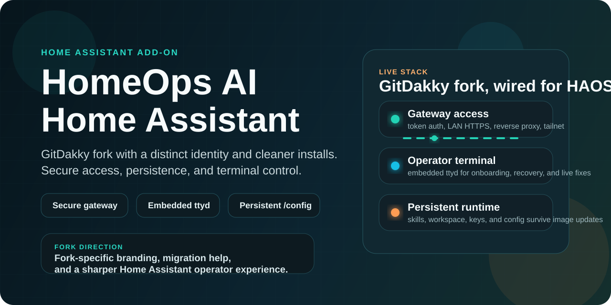
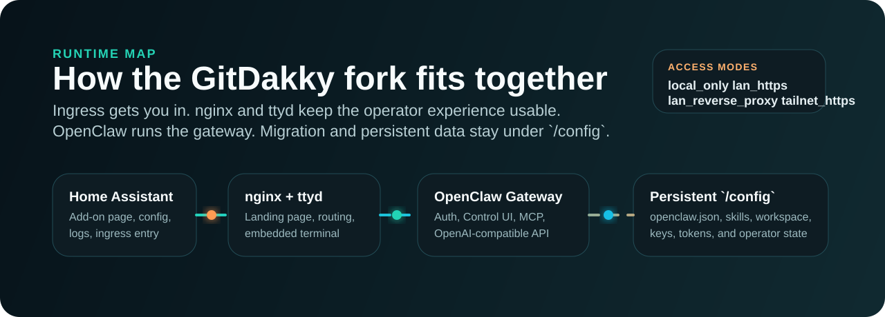

# HomeOps AI



HomeOps AI is the GitDakky fork of the OpenClaw Home Assistant app. It runs **OpenClaw** inside **HAOS** with a secure gateway, embedded terminal, browser automation stack, and persistent workspace.

This fork also mounts the live Home Assistant configuration root at `/ha-config` so the assistant can inspect and repair the actual HA system in place. `/config` remains the add-on's own persistent workspace.

This fork exists to keep pace with OpenClaw releases and improve the operator experience around them. Faster updates. Cleaner docs. Better presentation. No leftover filler.

[Documentation](DOCS.md) · [Security](SECURITY.md) · [Changelog](homeops_ai/CHANGELOG.md) · [Issues](https://github.com/GitDakky/homeops-ai/issues)

## Bundled version

- Bundled OpenClaw: `2026.4.2`
- Previous add-on lineage pin: `2026.3.13`
- Check the live version inside the add-on with `openclaw --version`
- Published image: `ghcr.io/gitdakky/homeops-ai`

## Contribute

Do not buy me a coffee. Do not sponsor this repo. If you want to help, open an issue, send a fix, improve the docs, test releases, or contribute code.

## Fork mission

- Keep this add-on close to current OpenClaw releases instead of lagging behind.
- Make the Home Assistant experience operationally sound: ingress, HTTPS, token auth, reverse proxy, Tailscale, ttyd, persistence.
- Replace throwaway repo presentation with branding that looks deliberate.
- Ship a real CI/CD path: validate every change, build the add-on image in CI, and publish the multi-arch image from `main`.
- Be unmistakably separate from the legacy add-on so users do not confuse the fork with the abandoned line.

## Hardening priorities

This fork is intentionally biased toward fixing the classes of problems that have slowed down or confused users in the older add-on line:

- Stay current with upstream OpenClaw releases so users are not stranded on old gateway/auth behavior.
- Keep startup config reconciliation complete and deterministic, especially for `remote` mode, proxy settings, persisted state, and generated `openclaw.json`.
- Reduce LAN/Tailscale/HTTPS friction so the gateway URL, landing page, browser security model, and Home Assistant ingress story all agree.
- Make local operator flows reliable inside the add-on container, including CLI-to-gateway calls, cron/runtime visibility, terminal recovery, and restart safety.
- Preserve user state under `/config` and keep migration paths predictable when users move from the legacy add-on or older OpenClaw layouts.
- Tighten validation so user-facing changes land with docs, metadata, translations, and image/release wiring already aligned.

## What this add-on gives you

| Capability | What it gives you |
|---|---|
| Secure gateway access | Token auth, `lan_https`, reverse proxy support, and tailnet-friendly modes |
| Embedded terminal | `ttyd` inside Home Assistant for onboarding, recovery, and live ops |
| Automation runtime | OpenClaw gateway, skills, MCP support, and OpenAI-compatible API access |
| Unattended automation mode | Exec approval prompts are disabled by default so Home Assistant automations and agent workflows do not stop for human approval |
| Seeded operator brain | Preloaded workspace files (`AGENTS.md`, `IDENTITY.md`, `TOOLS.md`, `MEMORY.md`, and more) plus Home Assistant skill files |
| Operator dashboard | Live cron/heartbeat visibility, file editing for the seeded workspace and skills, integration status cards, and a persistent Home OS Memory tab |
| Operator insight cards | Read-only homeowner, energy, system, predictive-maintenance, and security summaries from live HA state plus local runtime settings |
| Home OS Memory | Persistent house journal, doctor score, config drift notes, incident summaries, and a human-readable risk register under `/config/.openclaw/home-os-memory/` |
| Live HA tool layer | Built-in Home Assistant tools for entities, devices, areas, automations, services, template rendering, and bounded history |
| Live HA config access | Direct access to the real Home Assistant config root at `/ha-config` for recovery, package/include diagnosis, and custom component inspection |
| Matrix channel | Optional Matrix channel wiring from Home Assistant settings with homeserver auth, DM and room policies, allowlists, and ad-hoc room invites via `groupPolicy=open` + `autoJoin=always` |
| External intelligence hooks | Optional Context7, Domotz, GitHub issue reporting, MQTT/HiveMQ, BACnet scout, and lightweight system graph scaffolding |
| Browser tooling | Chromium bundled for automation and web-driven workflows |
| Persistent state | Config, skills, agent workspace, keys, and tokens survive add-on updates |
| Useful CLI stack | `git`, `jq`, `python3`, `ripgrep`, `curl`, `pnpm`, Homebrew, and more |

## Full feature list

### Core runtime

- Bundles upstream OpenClaw `2026.4.2` inside the add-on image.
- Runs the OpenClaw gateway directly inside Home Assistant OS with a managed startup wrapper.
- Exposes the OpenAI-compatible API surface for local agent and voice-assistant workflows.
- Ships a browser automation stack with Chromium for web-driven tasks.
- Includes a practical CLI toolkit in the container: `git`, `jq`, `python3`, `curl`, `ripgrep`, `fd`, `bat`, `pnpm`, Homebrew, and related operator tools.

### Operator surfaces

- Embedded `ttyd` terminal inside Home Assistant ingress.
- Operator dashboard with terminal-first layout and tabbed sections.
- Dashboard file editor for seeded workspace files and bundled skills.
- Live scheduler and heartbeat visibility from `openclaw cron` and `openclaw system heartbeat`.
- Integration rack for Context7, Domotz, GitHub issue reporting, MQTT, BACnet, MCP, and mounted HA config visibility.
- Home intelligence cards for homeowner summary, energy, system, predictive maintenance, and security posture.
- Home OS Memory tab with a persistent house journal, recent changes, incident queue, risk register, and first Doctor scorecard.

### Home Assistant integration

- Built-in Home Assistant tool layer for live entities, devices, areas, automations, templates, and bounded history reads.
- Optional mutating Home Assistant service calls behind `enable_ha_service_calls`.
- Direct writable mount of the real Home Assistant config root at `/ha-config`.
- In-place access to `configuration.yaml`, `secrets.yaml`, `custom_components/`, `packages/`, and `.storage/`.
- Dashboard and operator flows that can inspect the live HA system without relying only on shell scraping.

### Access, auth, and networking

- Token-auth gateway mode by default.
- `lan_https` mode for built-in HTTPS access on local networks.
- Reverse-proxy-friendly access patterns for NPM, Caddy, Traefik, and similar setups.
- Tailnet-friendly access modes and explicit browser-facing `gateway_public_url` handling.
- Loopback-only local mode for same-host operator workflows.
- Trusted-proxy support with configured proxy CIDRs or IPs.
- Deterministic gateway URL derivation on the landing page for common local cases.

### Persistence and migration

- Persistent OpenClaw workspace under `/config/clawd`.
- Persistent OpenClaw state, skills, auth, tokens, and graph data under `/config/.openclaw/`.
- Persistent global npm install redirection under `/config/.node_global/`.
- Persistent Homebrew installation under `/config/.linuxbrew/`.
- First-start migration path from the legacy HomeOps AI add-on.
- Reconciliation of older single-agent OpenClaw layouts into the current `agents/main/...` structure.
- Restart-safe config reconciliation for gateway mode, auth mode, proxy state, and related runtime settings.

### Seeded operator brain

- Seeded workspace files: `AGENTS.md`, `BOOTSTRAP.md`, `HEARTBEAT.md`, `IDENTITY.md`, `MEMORY.md`, `SOUL.md`, `TOOLS.md`, and `USER.md`.
- Seeded Home Assistant operator skills for operations, automations, voice, diagnostics, research, network mapping, MQTT, Domotz, BACnet, and repo issue reporting.
- Prompt bootstrap that now explicitly teaches the default agent about `/ha-config`, Home OS Memory, and the Doctor/Memory dashboard surfaces.

### External integrations and channels

- Optional Matrix channel wiring from add-on settings.
- Optional Context7 support for current technical documentation.
- Optional Domotz integration support for network inventory and troubleshooting.
- Optional MQTT / HiveMQ broker wiring.
- Optional BACnet scout scaffolding and dashboard status.
- Optional GitHub issue reporting directly into this fork.

### Reliability and hardening

- Local validation contract in `scripts/validate_local.sh`.
- CI validation workflow plus multi-arch add-on image build/publish workflow.
- Startup helpers and tests around gateway URL handling, migration safety, and config synchronization.
- Matrix startup now fails closed when auth or homeserver settings are incomplete.
- Home OS Memory and Doctor layers now surface current drift, unavailable entities, disk pressure, stale secrets, and config visibility.

## Install in 60 seconds

[](https://my.home-assistant.io/redirect/supervisor_repository/?repository_url=https%3A%2F%2Fgithub.com%2FGitDakky%2Fhomeops-ai)

1. In Home Assistant, open **Settings -> Apps**.
2. Click the button above to add the repository directly, or click **Install App** in the blue button at the bottom-right.
3. If you are adding it manually, paste this repository URL:
   - `https://github.com/GitDakky/homeops-ai`
4. Exit the dialog, select **HomeOps AI** from the list, and click **Install**.
5. Look for the GitDakky fork branding with the lobster-in-cape crest so you do not pick the legacy add-on by mistake.
6. Start the app, open the embedded terminal, and run:

```sh
oc-onboard
```

`oc-onboard` is the managed onboarding wrapper for this add-on. It runs the normal OpenClaw wizard, then automatically recycles the local gateway if onboarding changed gateway auth or other runtime-critical settings. That avoids the token mismatch split-brain that can happen if a live gateway keeps an old in-memory token after `openclaw.json` is rewritten.

7. If the legacy HomeOps AI add-on is installed, this fork will try to stop it and import its add-on config on first start.
8. Retrieve the gateway token:

```sh
jq -r '.gateway.auth.token' /config/.openclaw/openclaw.json
```

Before you test the Gateway UI:

- If you are staying on the same HA host or just using the terminal first, the default local path is fine.
- If you want to open the Control UI from a phone, tablet, or another LAN browser, switch `access_mode` to `lan_https` and restart before testing.
- If you are using a reverse proxy, Tailscale hostname, or remote gateway, leave `gateway_public_url` empty unless you need to override the browser-facing host. In remote mode, keep `gateway_remote_url` as `ws://` or `wss://` and use `gateway_public_url` only for the browser launch URL.

For later reconfiguration, use `oc-configure` instead of raw `openclaw configure` for the same reason.

For the full setup flow, secure-access recipes, and troubleshooting, use [DOCS.md](DOCS.md).

In most local installs, leave `gateway_public_url` empty. The landing page now derives the Gateway URL automatically from the Home Assistant host and access mode in the common local cases. Only set it when you need to override that with a reverse-proxy or Tailscale hostname.

## Live Home Assistant access

- The add-on now ships a built-in Home Assistant tool layer by default. OpenClaw can read live entities, devices, areas, automations, services, templates, and recent history without asking you to wire a separate MCP server or scrape files.
- Read access is enabled by default inside the trusted add-on context.
- Mutating Home Assistant service calls stay opt-in behind the `enable_ha_service_calls` option.
- `homeassistant_token` is now mainly for your own scripts and legacy external MCP workflows. It is no longer required for the built-in live Home Assistant read tools.
- The real Home Assistant config root is mounted at `/ha-config`. Use that path for `configuration.yaml`, `secrets.yaml`, `custom_components/`, `packages/`, and `.storage/`.
- `/config` is still the add-on-owned persistent workspace for OpenClaw state, skills, keys, and tokens. Do not confuse it with the live HA config tree.

## Runtime



- Home Assistant ingress for the landing page and operational entry point
- `nginx` + `ttyd` for browser-based setup and terminal access
- OpenClaw gateway for chat, skills, MCP, and the OpenAI-compatible endpoint
- Seeded OpenClaw workspace bootstrap files and GitDakky Home Assistant skill pack under persistent storage
- A lightweight local dashboard API that powers file editing, cron/heartbeat visibility, integration status, Home OS Memory / Doctor summaries, and system-graph metadata on the ingress page
- First-start state reconciliation for older single-agent OpenClaw layouts so legacy auth/session data lands in `agents/main/...`
- Persistent `/config` storage so updates do not wipe the working environment

## Seeded workspace and skills

- On first boot, the add-on seeds `/config/clawd` with `AGENTS.md`, `BOOTSTRAP.md`, `HEARTBEAT.md`, `IDENTITY.md`, `MEMORY.md`, `SOUL.md`, `TOOLS.md`, and `USER.md`.
- It also seeds `/config/.openclaw/skills/` with GitDakky-managed Home Assistant skills for operations, automations, voice, diagnostics, network mapping, MQTT, Domotz, BACnet, research, and repo issue reporting.
- If you add a fine-grained GitHub token with `Issues: write` in add-on settings, the assistant can file bugs and feature requests directly to [this repository’s Issues](https://github.com/GitDakky/homeops-ai/issues) via `oc-report-issue`.
- The dashboard now exposes those files directly so you can review or edit them without dropping into a shell unless you want to.

## Roadmap

This is the direction of the fork. Items below are roadmap work unless already called out as shipped elsewhere in this README or in the changelog.

### Near-term hardening

- Stay ahead of the legacy line on OpenClaw version bumps, gateway fixes, and release cadence.
- Keep closing operational gaps around `remote` mode, Tailscale/HTTPS access, LAN gateway discovery, and CLI-to-gateway reliability.
- Expand validation and smoke coverage for startup, nginx rendering, onboarding, migration, and persistence-sensitive changes.
- Continue turning Home Assistant add-on options into safe, first-class runtime wiring instead of asking users to patch `openclaw.json` by hand.

### Home intelligence

- Predictive maintenance flows that look at device history, failures, battery patterns, climate/runtime drift, and service intervals before something breaks.
- Homeowner insight packs that summarize what changed in the house, what is costing money, what is behaving oddly, and what should be automated next.
- Energy optimization loops that use tariffs, solar/battery signals, occupancy, weather, and appliance patterns to recommend or trigger better schedules.
- System optimization that watches Home Assistant, add-ons, network reachability, and automations for drift, dead integrations, noisy logs, and performance regressions.
- Security insight layers that surface exposed services, risky automations, stale secrets, unexpected device behavior, and weak network posture in plain language.

### Voice and communications

- Richer Assist and voice-agent flows so OpenClaw becomes the practical operations brain behind Home Assistant conversations.
- Multi-channel voice and call routing built around Janus so the assistant can reach the homeowner on the channel that actually matters at the time.
- Channel targets under consideration include Matrix, 3CX, WhatsApp, and other voice-capable communications surfaces where escalation or acknowledgement matters.
- Escalation logic should support notifying, calling, summarizing, and following up across channels when the house needs a human decision.

## Supported architectures

| Architecture | Supported |
|---|---|
| `amd64` | Yes |
| `aarch64` | Yes |
| `armv7` | No |

## Migration

- This fork uses a distinct app name, slug, and image so it does not masquerade as the legacy add-on.
- Clean installs now default to different host-network ports from the legacy add-on: gateway `18790`, terminal `7682`, ingress `48109`.
- On a first boot, if the legacy `homeops_ai` install is detected and this fork has no existing state, it will try to stop the old add-on and import its add-on config automatically.
- On startup, the add-on now also reconciles older OpenClaw `agent/` and `sessions/` layouts into the current `agents/main/...` structure before the gateway comes up.
- If the legacy add-on is still running and automatic migration fails, stop or uninstall the old add-on before starting this fork to avoid host-network port conflicts.

## First-start recovery

- If a freshly hatched agent reports missing provider keys from `agents/main/agent/auth-profiles.json`, restart the add-on once so the legacy-to-current state reconciliation can run.
- If local terminal or TUI access shows `pairing required` on a loopback-style install, restart once and retry. This fork now auto-approves same-host local operator pairing requests after the gateway starts.
- Full operator guidance lives in [DOCS.md](DOCS.md).

## Read next

- [DOCS.md](DOCS.md): installation, configuration, access modes, MCP, persistence, troubleshooting
- [SECURITY.md](SECURITY.md): risk model, exposure guidance, and safe operating practices
- [homeops_ai/CHANGELOG.md](homeops_ai/CHANGELOG.md): release notes for add-on versions
- [ROADMAP.md](ROADMAP.md): execution backlog for hardening, home intelligence, and voice/escalation work
- [MAINTENANCE.md](MAINTENANCE.md): how this fork pins, bumps, validates, and releases OpenClaw updates
- [VOICE_ESCALATION_POLICY.md](VOICE_ESCALATION_POLICY.md): target order, acknowledgement semantics, and escalation rules
- [JANUS_MEDIA_CONTROL_PLANE.md](JANUS_MEDIA_CONTROL_PLANE.md): future media/control boundary for outbound voice sessions

## Companion integration

The companion integration lives here:

- [homeops-aiIntegration](https://github.com/techartdev/homeops-aiIntegration)

Use it with these connection rules:

- If the integration and this add-on are on the same Home Assistant host, prefer auto-discovery or the local gateway path. Do not point it at the Home Assistant ingress page URL.
- If the integration runs from another Home Assistant instance or another machine, point it at the real reachable gateway URL and use the gateway token.
- If this add-on is set to `gateway_mode=remote`, connect the integration to the remote gateway itself. The add-on page stays the operator surface, not the gateway endpoint.

The full connection guidance lives in [DOCS.md](DOCS.md).
